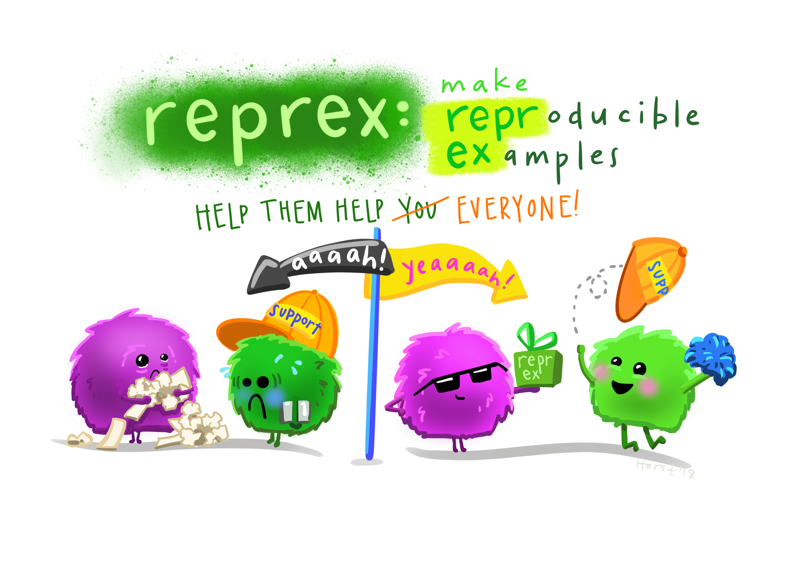

class: left, middle
background-image: url(`r params$background_img`)
background-size: contain
background-position: right

## rstudio::global(2021) %>% summarize()  
### Dr Shazia Ruybal Pesántez 
R-Ladies Melbourne Meetup

2021/04/15

```{r setup, include=FALSE}
options(htmltools.dir.version = FALSE)

library(xaringanthemer)
library(xaringanExtra)
library(showtext)
library(fontawesome)
library(metathis)
library(tidyverse)
library(palmerpenguins)
library(formatR)
```

[`r fa(name = "github")` @shaziaruybal](http://github.com/shaziaruybal)  
[`r fa(name = "twitter")` @DrShaziaRuybal](http://twitter.com/DrShaziaRuybal)  
[`r fa(name = "link")` shaziaruybal.com](https://shaziaruybal.com)  

```{r xaringan-themer, include=FALSE, warning=FALSE}
style_duo_accent(
  primary_color = "#6b7a5b",
  secondary_color = "#E3AFBC", 
  header_color = "#6b7a5b", 
  inverse_header_color = "#ffffff", 
  code_highlight_color = "ffffff",
  text_color = "#6b7a5b",
  header_font_google = google_font("News Cycle"),
  text_font_google   = google_font("Dosis", "300", "300i"),
  code_font_google   = google_font("Fira Mono")
)
```


```{r metathis, echo=FALSE}
meta() %>%
  meta_name("github-repo" = "shaziaruybal/rstudioglobal2021-divscholar-recap") %>% 
  meta_social(
    title = "rstudio::global(2021) diversity scholar workshops recap",
    description = paste(
      "A recap of the diversity scholar workshops at the rstudio global conference 2021",
      "Presented at the R-Ladies Melbourne meetup April 2021."
    ),
    url = "https://shaziaruybal.github.io/rstudioglobal2021-divscholar-recap",
    image = "https://shaziaruybal.github.io/rstudioglobal2021-divscholar-recap/img/social-card.png",
    image_alt = paste(
      "Title slide of rstudio::global(2021) diversity scholar workshop recap", 
      "presented at the R-Ladies Melbourne meetup April 2021 by Shazia Ruybal-Pesántez"
    ),
    og_type = "website",
    og_author = "Shazia Ruybal-Pesántez",
    twitter_card_type = "summary_large_image",
    twitter_creator = "@DrShaziaRuybal",
    twitter_site = "@DrShaziaRuybal"
  )
```

???
can add notes here, this is pretty cool :)


---
class: inverse, center, middle

# A little bit about me

---
name: background

# My background

--

🌎 Originally from Ecuador 🇪🇨 and the US 🇺🇸

--

🎓 BA Biology [Colorado College](https://coloradocollege.edu)

--

🎓 PhD Genetic Epidemiology [University of Melbourne](https://unimelb.edu.au)

--

📍 Postdoctoral scientist at [Walter and Eliza Hall Institute of Medical Research](https://wehi.edu.au/people/ivo-mueller), [University of Melbourne](https://unimelb.edu.au) and [Burnet Institute](https://www.burnet.edu.au/people/701_shazia_ruybal)

--

🧬 My research focuses on applied ("field") epidemiology and genomic epidemiology of infectious diseases, mostly malaria 🦟 and more recently COVID-19 🦠

--

👩🏼‍💻 I use R for data processing, visualization, communication, dashboards, shiny

--

💜 Secretary and co-organizer of [R-Ladies Melbourne Inc](https://twitter.com/rladiesmelb)

--

🔗 [Get in touch](#contact) 

---
background-image: url(https://github.com/allisonhorst/stats-illustrations/raw/master/rstats-artwork/r_rollercoaster.png)
background-size: 80% 70%
background-position: center

# My R journey in a nutshell

.footnote[*[Credit to @alison_horst for the beautiful aRtwork](https://github.com/allisonhorst/stats-illustrations)*]

---
background-image: url(https://github.com/allisonhorst/stats-illustrations/raw/master/rstats-artwork/welcome_to_rstats_twitter.png)
background-size: 50% 85%
background-position: center

# My R journey in a nutshell

.footnote[*[Credit to @alison_horst for the beautiful aRtwork](https://github.com/allisonhorst/stats-illustrations)*]

---
class: inverse center, middle

# rstudio::global(2021) 24hr virtual conference

--

### Three "tracks": (1) learning (2) language interop (3) visualization

--

### The focus of today's talk is not on the main conference, since all of the 55  (!) talks are freely available [here](https://www.rstudio.com/resources/rstudioglobal-2021/)!

---
class: left

# But some honorable mentions below...

- ["Your public garden" - Vicki Boykis](https://www.rstudio.com/resources/rstudioglobal-2021/your-public-garden/): thoughtful reflections on how and why we should cultivate our 'digital' garden
--

- ["Reporting on and visualising the pandemic" - John Burn-Murdoch](https://www.rstudio.com/resources/rstudioglobal-2021/reporting-on-and-visualising-the-pandemic/): lessons learned on how to best communicate data
--

- ["Always look on the bright side of plots" - Kara Woo](https://www.rstudio.com/resources/rstudioglobal-2021/always-look-on-the-bright-side-of-plots/): common mistakes and misunderstandings when using `{ggplot2}`
--

- ["Trial and Error in Data Viz at the ACLU" - Sophie Beiers ](https://www.rstudio.com/resources/rstudioglobal-2021/trial-and-error-in-data-viz-at-the-aclu/): reflections on how to and how *not* to make data visualizations
--

- ["Make a package - Make some friends" - Athanasia Mowinckel](https://www.rstudio.com/resources/rstudioglobal-2021/make-a-package-make-some-friends/): a personal experience making an R package
--

- ['How to do things with words: learning to program in R with a "communicative approach" - Riva Quiroga'](https://www.rstudio.com/resources/rstudioglobal-2021/how-to-do-things-with-words-learning-to-program-in-r-with-a-communicative-approach/): a perspective on the process of learning R and how we can make learning/teaching easier
--

- ["On programming, teaching, and building interactive tutorials with learnr - Yanina Bellini Saibene"](https://www.rstudio.com/resources/rstudioglobal-2021/on-programming-teaching-and-building-interactive-tutorials-with-learnr/): a talk on how to use `{learnr}` for interactive tutorials and virtual teaching
--

- ["An easy and friendly way to build your multilingual website - Pamela Pairo"](https://www.rstudio.com/resources/rstudioglobal-2021/an-easy-and-friendly-way-to-build-your-multilingual-website/): a talk on how to have your `{blogdown}` website in more than one language
--

- A nice summary of key talks by [Clare West](https://clarewest.github.io/blog/post/rstudio-global-2021-summarise/)
--

- Some post-conference thoughts by [Joseph Rickert](https://rviews.rstudio.com/2021/02/04/some-thoughts-on-rstudio-global/)
--

.footnote[*not an exhaustive list!]

---
class: inverse, center, middle

# rstudio::global(2021) 24hr virtual conference

--

```{r tidy=TRUE,eval=FALSE}
rstudio::global(2021) %>% 

filter(workshops == "diversity scholars") %>% summarize()
```

--

.footnote[*Note that these workshops took place after the main conference*]

---
class: center, middle

# Lucky me!
.pull-left[<blockquote class="twitter-tweet"><p lang="en" dir="ltr">Coming back online after a much needed break and so excited to announce that I’ve been selected as a Diversity Scholar for the <a href="https://twitter.com/rstudio?ref_src=twsrc%5Etfw">@rstudio</a>::global(2021) conference 🤩🎉 very honored for this opportunity! Can’t wait to share learnings with the <a href="https://twitter.com/RLadiesMelb?ref_src=twsrc%5Etfw">@RLadiesMelb</a> community 💜</p>&mdash; Shazia Ruybal Pesántez (@DrShaziaRuybal) <a href="https://twitter.com/DrShaziaRuybal/status/1349110392442687489?ref_src=twsrc%5Etfw">January 12, 2021</a></blockquote> <script async src="https://platform.twitter.com/widgets.js" charset="utf-8"></script>


]


.pull-right[]

---
name: workshop-overview

# Diversity Scholar Workshops

.pull-left[
### Workshop 1: 
**[Introduce Yourself Online by Alison Hill](https://iyo-rstudio-global.netlify.app)**


]

.pull-right[
### Workshop 2: 
**[What they forgot to teach you about *teaching* R by Mine Çetinkaya-Rundel](https://wtf-teach.netlify.app)**


]

---

# Disclaimer

### All of the material I will share today is summarised from the workshop materials that can be found at:

#### - [Introduce Yourself Online by Alison Hill: https://iyo-rstudio-global.netlify.app/ ](https://iyo-rstudio-global.netlify.app/)


#### - [What they forgot to teach you about *teaching* R by Mine Çetinkaya-Rundel: https://wtf-teach.netlify.app ](https://wtf-teach.netlify.app)

.footnote[
*There is a lot that I won't get through today, so I encourage you to visit these sites and work through all the amazing materials!*
]

---
class: inverse, center, middle

# Workshop 1: Introduce Yourself - Alison Hill

---
class: inverse

# Introduce Yourself Online: some options

--
### 1️⃣ Your "name tag": Github profile 
--

### 2️⃣ Your "business card": `{postcards}`
--

### 3️⃣ Your "cup of coffee": `{distill}`
--

### 4️⃣ Happy hour: `{blogdown}`

.footnote[
*[Original workshop materials by Alison Hill at: https://iyo-rstudio-global.netlify.app/](https://iyo-rstudio-global.netlify.app/)*
]

---
class: center, middle

# How many of you have a github profile? 
## ❤️ if you do
## 😮 if you don't

---

# 1️⃣ Your "name tag": Github profile 
.pull-left[
### Assuming you have a github profile already, edit the README repository to write a short bio

#### [Read more about github profiles at: https://docs.github.com/en/github/setting-up-and-managing-your-github-profile/personalizing-your-profile](https://docs.github.com/en/github/setting-up-and-managing-your-github-profile/personalizing-your-profile) 
]


.footnote[
[Original workshop materials by Alison Hill at: https://iyo-rstudio-global.netlify.app/](https://iyo-rstudio-global.netlify.app/)
]

--

.pull-right[]


---

# Minimal example


.footnote[
*[Link to the example here](https://github.com/shaziaruybal)*
]

---
class: inverse center, middle

# How many of you have used `{postcards}`? 
## ❤️ if you have
## 😮 if you haven't

---

# 2️⃣ Your "business card": `{postcards}`
.pull-left[

```{r tidy=TRUE, eval=FALSE}
install.packages("postcards")
library(postcards)

create_postcard()

# use templates
create_postcard(template == "jolla")

# knit the .Rmd
rmarkdown::render("index.Rmd")
```

]

.footnote[
*[Original workshop materials by Alison Hill at: https://iyo-rstudio-global.netlify.app/](https://iyo-rstudio-global.netlify.app/)*
]

.pull-right[
### Postcards are created using `{rmarkdown}` and can serve as a 'landing page'

#### [Take a look at the templates here: https://github.com/seankross/postcards](https://github.com/seankross/postcards) 
]

---

# A minimal example: "Jolla" template


.footnote[
*[Link to the example here](https://shaziaruybal.github.io/iyo/)*
]

---
class: inverse center, middle

# How many of you have used `{distill}`? 
## ❤️ if you have
## 😮 if you haven't

---

# 3️⃣ Your "cup of coffee": `{distill}`
 
### - `{distill}` websites are created using only `{rmarkdown}` 

--

### - they can be deployed using Github pages or Netlify

--

#### [Read more about distill websites at: https://rstudio.github.io/distill/](https://rstudio.github.io/distill/) 

--

#### [Read this blog post about creating a `{distill}` website in less than 30 minutes](https://www.andreashandel.com/post/distill-github-website/)

--
#### [Some distill website inspo here: https://jhelvy.github.io/distillery/](https://jhelvy.github.io/distillery/)

---

# A minimal example

.pull-left[

]

.pull-right[

]

.footnote[
*[Link to the example here](https://shaziaruybal.github.io/distill-website/)*
]

---
class: inverse center, middle

# How many of you have used `{blogdown}`? 
## ❤️ if you have
## 😮 if you haven't

---

# 4️⃣ Happy hour: `{blogdown}`
 
### - `{blogdown}` websites are created using `{rmarkdown}` and Hugo 

--

### - they can be deployed using Github pages or Netlify

--

### - more customization but requires Hugo, more advanced 

--
#### [Read more about blogdown websites at: https://bookdown.org/yihui/blogdown/](https://bookdown.org/yihui/blogdown/) 

--

#### [Alison Hill has so many amazing resources on her website, such as: https://alison.rbind.io/post/new-year-new-blogdown/ ](https://alison.rbind.io/post/new-year-new-blogdown/)

--

---

# Quick shout-out to the Apéro theme 🇫🇷🍸

.pull-left[

]

.pull-right[
### [Check out the template here: https://github.com/apreshill/apero](https://github.com/apreshill/apero) 

### [Check out the demo site here: https://hugo-apero.netlify.app](https://hugo-apero.netlify.app) 

]
---

.pull-left[<blockquote class="twitter-tweet"><p lang="en" dir="ltr">The 60+ <a href="https://twitter.com/hashtag/rstats?src=hash&amp;ref_src=twsrc%5Etfw">#rstats</a> <a href="https://twitter.com/hashtag/RLadies?src=hash&amp;ref_src=twsrc%5Etfw">#RLadies</a> bloggers 👇 make my heart so happy! 💜💜💜 Come join us! Here’s a blogdown vs distill comparison 💫 made in collaboration w/ <a href="https://twitter.com/apreshill?ref_src=twsrc%5Etfw">@apreshill</a>, and more resources to help you get started!<a href="https://t.co/onF97t7DNQ">https://t.co/onF97t7DNQ</a> <a href="https://t.co/xeMhkURNyV">pic.twitter.com/xeMhkURNyV</a></p>&mdash; We are R-Ladies (@WeAreRLadies) <a href="https://twitter.com/WeAreRLadies/status/1363144545677017089?ref_src=twsrc%5Etfw">February 20, 2021</a></blockquote> <script async src="https://platform.twitter.com/widgets.js" charset="utf-8"></script>
]

.pull-right[
### `{blogdown}` vs. `{distill}`


⬅️ Check out the thread highlighting #RLadies blogs!
]

---
class: inverse, center, middle

# Workshop 2: What they forgot to teach you about *teaching* R - Mine Çetinkaya-Rundel

---
class: inverse

# What they forgot to teach you about *teaching* R

--
### 1️⃣ Live coding best practices + teaching tips 
--

### 2️⃣ Teaching tools: RStudio Cloud and `{learnr}` tutorials
--

### 👩🏼‍🏫 if you are an educator, I highly recommend going through the full workshop materials

.footnote[
*[Original workshop materials by by Mine Çetinkaya-Rundel at: https://wtf-teach.netlify.app ](https://wtf-teach.netlify.app)*
]

---
class: inverse center, middle

# How many of you teach #rstats?
## ❤️ if you do

---

# 1️⃣ Live coding best practices + teaching tips 
 
### - Approaching teaching like cooking
#### "Let them eat cake first" - Mine Çetinkaya-Rundel

.pull-left[

]

---

# 1️⃣ Live coding best practices + teaching tips 
 
### - Approaching teaching like cooking
#### "Let them eat cake first" - Mine Çetinkaya-Rundel

.pull-left[

]

.pull-right[
 
]


.footnote[*[Original workshop materials by by Mine Çetinkaya-Rundel at: https://wtf-teach.netlify.app ](https://wtf-teach.netlify.app)*]

---

# 1️⃣ Live coding best practices + teaching tips 
 
#### Teach your students a complex visualization first, and build up to it together

.pull-left[
```{r plot-first, fig.show='hide'}
library(tidyverse)
library(palmerpenguins)

penguins %>% 
  group_by(species, island) %>% 
  tally() %>% 
  ggplot(aes(x = island, y = n, 
             fill = species)) + 
    geom_bar(stat = "identity", 
             position = "fill") +
    scale_y_continuous(
      labels = scales::label_percent(1)) +
    labs(y = "",
         title = "Penguin spp distribution",
         caption = "Credit to {palmerpenguins}") +
    theme_minimal() +
    theme_xaringan()
```
]

.pull-right[
```{r ref.label='plot-first', echo=F, out.width='90%'}
```
]

???
use rmarkdown with "fill in the blanks"
---

# 1️⃣ Live coding best practices + teaching tips 

### - "Live code early and often" - Mine Çetinkaya-Rundel
--

#### Talk through the code - mistakes are good learning experiences!
--

#### Context matters (live code first vs after static materials)

--

#### Pre-recording screencasts vs *live* coding
--

### Different learning styles
--

#### Not everyone learns the same
--

#### Fun and creative activities for lessons (e.g. ugly ggplot2)
--
.pull-right[.footnote[*[Original workshop materials by by Mine Çetinkaya-Rundel at: https://wtf-teach.netlify.app ](https://wtf-teach.netlify.app)*]
]

---

# 1️⃣++ Some extra tips 

### Challenging to provide instant/timely feedback for online courses
--

### Teach students how to find help!

--



--
.pull-right[

.footnote[

*[Credit to @alison_horst for the beautiful aRtwork](https://github.com/allisonhorst/stats-illustrations)*

*[Original workshop materials by by Mine Çetinkaya-Rundel at: https://wtf-teach.netlify.app ](https://wtf-teach.netlify.app)]*
]

---

# 2️⃣ Teaching tools: RStudio Cloud
 
#### Removes the need to spend ⏱ installing R, RStudio, packages etc on Day 1
#### [Read more about RStudio cloud here: https://rstudio.cloud/learn/guide](https://rstudio.cloud/learn/guide)

--


---

# 2️⃣ Teaching tools: `{learnr}`
 
### - Create interactive tutorials from `{rmarkdown}` .Rmd documents
#### For those giving online courses, `{gradethis}` package can be used to automate grading of tutorials

#### [Check out RStudio primers made with `{learnr}` here: https://rstudio.cloud/learn/primers](https://rstudio.cloud/learn/primers)

.footnote[
*[Original workshop materials by by Mine Çetinkaya-Rundel at: https://wtf-teach.netlify.app ](https://wtf-teach.netlify.app)*
]

---
class: inverse center middle

# Recap

---
name: w1-recap
class: inverse

.pull-left[
### Workshop 1: 
### Introduce Yourself Online - Alison Hill
*[Resources at: https://iyo-rstudio-global.netlify.app](https://iyo-rstudio-global.netlify.app)*


]


.pull-right[
### 1️⃣ Your "name tag": Github profile 
### 2️⃣ Your "business card": `{postcards}`
### 3️⃣ Your "cup of coffee": `{distill}`
### 4️⃣ Happy hour: `{blogdown}`
]

---
name: w2-recap
class: inverse

.pull-left[
### Workshop 2: 
### What they forgot to teach you about *teaching* R - Mine Çetinkaya-Rundel

*[Resources at: https://wtf-teach.netlify.app](https://wtf-teach.netlify.app)*

]


.pull-right[
### 1️⃣ Live coding best practices + teaching tips 
### 2️⃣ Teaching tools: RStudio Cloud and `{learnr}` tutorials (+ lots more!)
]


---
class: inverse center middle

# Gracias! 💜

--

### Heartfelt acknowledgment to **Alison Hill** and **Mine Çetinkaya-Rundel** for the amazing workshops, and to **RStudio** for selecting me as one of the Diversity Scholars 
--

### Thanks to you for your attention.

--

### Any questions?

---

name: contact
class: left, center


# Get in touch 💜

[`r fa(name = "twitter")` @DrShaziaRuybal](http://twitter.com/DrShaziaRuybal)
[`r fa(name = "github")` @shaziaruybal](http://github.com/shaziaruybal) 
[`r fa(name = "link")` shaziaruybal.com](https://shaziaruybal.com)  